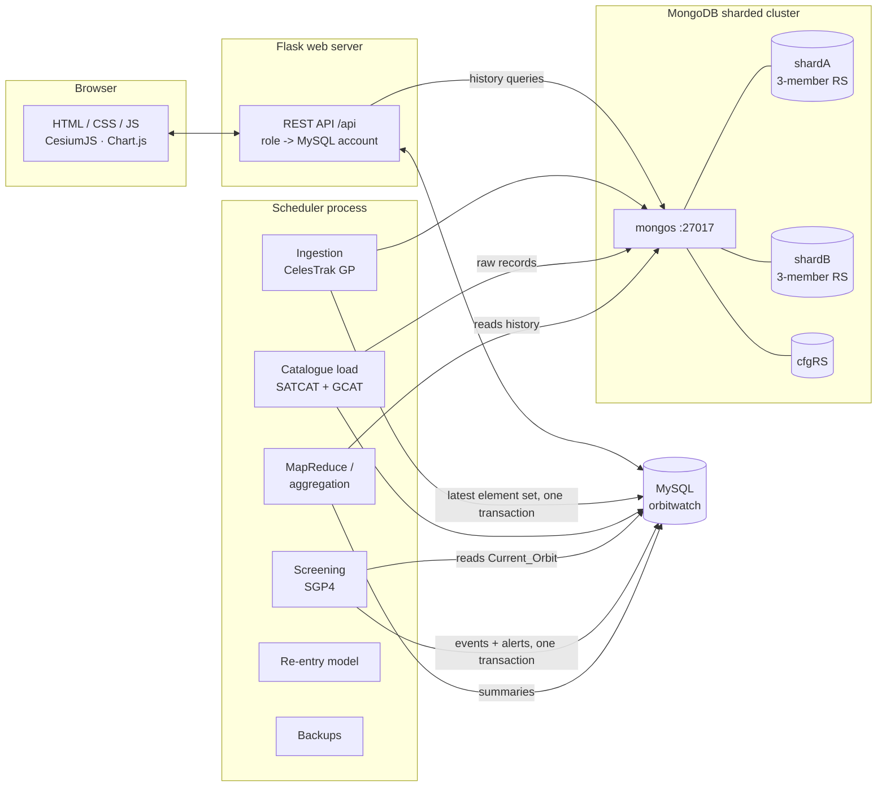

# OrbitWatch

**A Satellite and Space Debris Tracking System with Close-Approach Alerts**

RV College of Engineering, Department of Information Science and Engineering ·
Database Management Systems (CD252IA)
Team: 1RV24IS067 Madhur Rishi Sikarwar · 1RV24IS069 Mayur M Deekshith

▶️ **[Watch the demo video on YouTube](https://www.youtube.com/watch?v=Be4tBh7HUjg)**: a walkthrough of OrbitalGuard's
orbital tracking, conjunction detection, risk assessment, manoeuvre optimisation, agentic decision pipeline and
human-in-the-loop approval, all of which carry over into OrbitWatch.

OrbitWatch keeps a catalogue of space objects together with their owners, launches and missions, stores
the complete history of their orbits, screens a watchlist of satellites for close approaches every few
hours, alerts users who follow a satellite, and reports on how crowded each orbital region is and how
the debris population changes. On top of the SRS it keeps every capability of its predecessor, OrbitalGuard:
an **agentic AI decision-support agent** that assesses close approaches and recommends avoidance manoeuvres,
**probability of collision** for every event, a **minimum delta-v manoeuvre optimizer**, live **space weather**
and **ground-station contact windows**.

The website opens on a live 3D globe of everything being tracked, with a countdown to the next critical
approach, live ISS telemetry and a ticker of upcoming approaches. Below that are the altitude spectrum of
the catalogue, the capabilities, the data pipeline and the largest fragmentation events, all from live data.

| Layer | Technology |
|---|---|
| Relational database | **MySQL 8.4**: catalogue, latest orbit of each object, conjunction events, users, subscriptions, alerts, summaries |
| NoSQL database | **MongoDB 8.0**: append-only orbital history, raw catalogue records, download logs. Sharded on `norad_id`; every shard is a replica set |
| Backend | **Python 3.12 + Flask** REST API; **SGP4** orbit propagation; **APScheduler** jobs; **scikit-learn** re-entry model |
| Front end | HTML, CSS and JavaScript (ES modules); **CesiumJS** 3D globe; Chart.js |
| Data | **CelesTrak** element sets and SATCAT; **GCAT** for launches, vehicles, sites, organisations, parents and programmes; **Space-Track.org** for older history; **NOAA SWPC** space weather |
| AI | **Groq** LLM with native tool calling (default `openai/gpt-oss-120b`), deterministic tools and guardrails; runs without an API key in deterministic mode |

---

## Architecture



The two databases share `norad_id` as the integration key. After each download the raw element sets go
to MongoDB, and the newest element set of each object goes to MySQL `current_orbit` in one transaction.
The screening job reads orbits from MySQL and writes events back to MySQL. MapReduce and aggregation run
over the MongoDB history, and their results are stored in MySQL summary tables for the dashboard.

---

## Relational database (MySQL)

The 15 relations of the synopsis, plus the six the SRS implies (watchlist, configuration, job status,
two MongoDB summary tables, re-entry predictions):

| Table | Key | Notes |
|---|---|---|
| `country` | country_code | |
| `organisation` | org_id | org_type ∈ {Government, Private, Academic}, FK country |
| `launch_site` | site_id | latitude/longitude CHECK-constrained, FK country |
| `launch_vehicle` | vehicle_id | FK organisation (BUILDS) |
| `launch` | launch_id (COSPAR tag) | FK site (HOSTS), vehicle (USED_IN); outcome |
| `space_object` | norad_id | type ∈ {Payload, Rocket Body, Debris, Unknown}; FK launch (DEPLOYS); **recursive** `parent_norad_id` (BREAKS_FROM) |
| `mission`, `object_mission` | mission_id; (norad_id, mission_id) | M:N SERVES |
| `object_ownership` | (norad_id, from_date) | **time-based** OWNS; non-overlapping periods enforced by trigger |
| `orbit_region` | region_id | altitude bands; non-overlap enforced by trigger |
| `current_orbit` | norad_id | weak entity (HAS_LATEST_ORBIT); perigee/apogee/period are **generated columns** |
| `conjunction_event` | event_id | Space_Object takes part **twice** (primary, secondary) |
| `app_user`, `subscription`, `alert` | | alerts created by trigger (TRIGGERS) |
| `watchlist`, `system_config`, `job_run` | | screening watchlist, configurable thresholds and schedules, job status |
| `summary_monthly_altitude`, `summary_region_year` | | written from MongoDB MapReduce / aggregation |
| `reentry_prediction` | norad_id | output of the regression model |

**Normalisation (3NF).** Organisation and country details live in their own relations. The orbital
region is never stored with an object, because it depends on altitude rather than on the object's key.
It is derived by joining `current_orbit` with the altitude ranges in `orbit_region` (`v_object_region`,
`v_report_region_counts`). `current_orbit` stores the published mean elements that SGP4 needs.
Perigee, apogee, mean altitude and period depend on those elements, so they are **generated columns**
computed by MySQL itself, and can never disagree with the elements.

**Integrity.** There are primary, foreign, unique and CHECK constraints on every table: latitude and
longitude ranges, eccentricity in [0, 1), an object can't be its own parent, a decay date implies status
Decayed, an ownership period has to/from in order, a conjunction's two objects must differ, and so on.
Triggers handle what constraints can't express:

| Routine | Purpose |
|---|---|
| `trg_conjunction_alerts` | AFTER INSERT on `conjunction_event`: one alert per active subscriber of either object |
| `trg_ownership_no_overlap_ins/_upd` | ownership periods of an object never overlap |
| `trg_region_no_overlap_ins/_upd` | every altitude maps to exactly one region |
| `trg_object_decay_ins/_upd`, `trg_object_decayed_cleanup` | a decay date sets status Decayed and removes the object's current orbit and watchlist entry |
| `fn_risk_level(miss_km, rel_vel)` | LOW / MEDIUM / HIGH / CRITICAL |
| `sp_record_conjunction` | inserts a new event, or refines the same encounter re-predicted by a later run (no duplicate alert) |
| `sp_register_user` | self-registration that can only ever create a Public Viewer |

**Roles enforced by the database.** The web server keeps one MySQL account per application role and
uses the logged-in user's account for every query. Even if application code were wrong, MySQL refuses
what the role lacks:

| MySQL role | Account | Privileges |
|---|---|---|
| `r_viewer` | `ow_viewer` | SELECT on catalogue, orbits, events and public views; INSERT/DELETE own subscriptions; UPDATE only the two acknowledgement columns of `alert` |
| `r_analyst` | `ow_analyst` | `r_viewer` + summary tables and report views |
| `r_admin` | `ow_admin` | `r_analyst` + SELECT/INSERT/UPDATE/DELETE on all tables, EXECUTE; **no DDL** |
| `r_auth` | `ow_auth` | column-level SELECT on the login columns of `app_user`; EXECUTE `sp_register_user` only |
| `r_jobs` | `ow_jobs` | ingestion / screening / aggregation writes |
| `r_backup` | `ow_backup` | read-only dump privileges |

**Transactions.** Catalogue load, ingestion and screening each commit in one InnoDB transaction. Under
MVCC, readers keep seeing the previous consistent snapshot until the commit, so users never see a
partly updated set of orbits or events, and the jobs never block queries. A MySQL named lock
(`GET_LOCK`) stops two instances of the same job running at once.

**Indexes** on the frequently searched columns: `norad_id` (PK), `space_object(name)`,
`(object_type)`, `(launch_id)`, `(parent_norad_id)`, `(decay_date)`,
`conjunction_event(time_of_closest_approach)`, `(primary_norad, tca)`, `(secondary_norad, tca)`,
`(risk_level, tca)`, and `current_orbit(mean_altitude_km)` for the region join.

## NoSQL database (MongoDB)

| Collection | Content |
|---|---|
| `orbit_history` | every element set ever downloaded: one document per (norad_id, epoch) with orbital parameters, derived altitudes and the original JSON. **Sharded on `{norad_id: 1}`** |
| `raw_catalog` | raw SATCAT / GCAT records as downloaded, versioned (a new version only when the record changed) |
| `download_log` | every download attempt: URL, HTTP status, bytes, records, errors, retries |
| `mr_monthly_altitude` | MapReduce output |

* **Topology:** `mongos` on 27017, a config-server replica set (27019), and two shards that are each
  3-member replica sets (27101–27103, 27201–27203), with keyfile authentication. Stopping a shard's
  primary makes a secondary take over, which shows replication and fault tolerance.
* **Shard key:** `{norad_id: 1}` (ranged), pre-split at the median NORAD number so both shards hold
  data. A hashed key would not allow the unique `{norad_id, epoch}` index that makes the history
  append-only and idempotent.
* **MapReduce:** monthly average altitude per object (map / reduce / finalize in JavaScript) →
  `summary_monthly_altitude`. **Aggregation pipeline:** objects per region per year, with the region
  bands read from MySQL and turned into a `$switch` → `summary_region_year`. Also used for "fastest
  decaying objects". MapReduce has been deprecated since MongoDB 5.0 but still runs. It is used here
  to demonstrate the concept, alongside the aggregation framework.
* **Consistency across the two databases:** they can't share a transaction, so MongoDB is written
  first, idempotently (unique index), and MySQL commits second. A failed MySQL commit is simply retried
  without duplicating history.

---

## SRS compliance

| SRS | Requirement | Where |
|---|---|---|
| 3.1 | Registration/login with email + password, three roles, privileges in the DB, hashed passwords | `orbitwatch/auth.py` (bcrypt), `database/mysql/04_security.sql`, `sp_register_user` |
| 3.2 | Scheduled CelesTrak ingestion, history never overwritten, raw JSON + logs in MongoDB, `current_orbit` in a transaction, Space-Track import | `jobs/ingest.py`, `jobs/sources.py`, `jobs/spacetrack.py`, `jobs/scheduler.py` |
| 3.3 | Payload / Rocket Body / Debris, links to launch, vehicle, site, organisation, country, missions, parent, ownership history, status, decay; search and filter by name, NORAD, type, country, organisation, region | `jobs/catalog.py`, `web/catalog_api.py`, Catalogue page |
| 3.4 | SGP4 screening of the watchlist (Indian satellites + ISS), configurable threshold, events with TCA, miss distance, relative velocity, risk; transactional; filter by object, date, risk | `jobs/screening.py`, `sp_record_conjunction`, Close approaches page |
| 3.5 | Subscribe / unsubscribe, alert per subscriber on a new approach, view and acknowledge | `trg_conjunction_alerts`, `web/me_api.py`, My alerts page |
| 3.6 | Objects per region, debris per country, re-entries per year, altitude-loss rate, monthly average altitude and region-per-year via MapReduce/aggregation into MySQL | `03_views.sql`, `jobs/aggregate.py`, `web/reports_api.py`, Reports page |
| 3.7 | Analysts run reports, query history, export CSV; admins manage users/roles, reference data, watchlist, threshold, job status and logs | Reports and Admin pages, `web/admin_api.py` |
| 3.8 | CesiumJS globe with orbits and close-approach replay; regression model for remaining lifetime | `frontend/js/views/globe.js`, `jobs/reentry.py` |
| 4.1 | Indexed searches; jobs in the background | separate scheduler process, MVCC |
| 4.2 | Hashing, DB-level roles, parameterised queries, credentials outside code, HTTPS | bcrypt, `04_security.sql`, `%s` parameters only, `.env`, `orbitwatch/certs.py` |
| 4.3 | PK/FK/CHECK, transactional jobs, 3NF, failed downloads and jobs logged and retried | schema, `jobs/runner.py`, `download_log`, `job_run` |
| 4.5 | Modular components; configurable thresholds, watchlist, schedules; logging | `orbitwatch/` package, `system_config`, log files |
| 4.6–4.7 | Sharding, replica sets, regular backups | `orbitwatch/mongo_cluster.py`, `jobs/backup.py` |

**Where the implementation goes beyond or adjusts the documents:**

* `Current_Orbit` also stores the full mean elements (mean motion, eccentricity, RAAN, argument of
  perigee, mean anomaly, B*, …), because SGP4 cannot propagate from perigee/apogee/inclination/period
  alone. Those four columns of the synopsis are generated from the elements.
* Six operational tables are added (listed above). The SRS needs them for the watchlist, threshold,
  job monitoring and stored summaries.
* The synopsis's ER diagram omits `Country`, `App_User` and `Subscription`, and doesn't link `Alert`
  to a user. The implemented schema follows the relational table list, which has them.
* Public data has no clean source for missions or ownership changes. Missions are GCAT programmes.
  Ownership comes from GCAT's owner at launch, plus documented transfers in
  `database/mysql/ownership_transfers.csv` (e.g. Inmarsat → Viasat, 31 May 2023).
* CelesTrak's free GP groups cover all active payloads but only the major debris clouds (Fengyun-1C,
  Cosmos-2251, Iridium-33, GEO region, last 30 days). Debris *counts* per country cover the whole
  catalogue (SATCAT). Screening against every debris piece needs the full catalogue from Space-Track.

---

## Beyond the SRS: features carried over from OrbitalGuard

OrbitWatch began as **OrbitalGuard**, a GDG space-tech project. Nothing it could do was dropped. Its code is
preserved unchanged in [`legacy/orbitalguard/`](legacy/orbitalguard), and its features are rebuilt here on
OrbitWatch's own data:

| Feature | How it works in OrbitWatch | Where |
|---|---|---|
| **Agentic AI decision support** | For one close approach, an LLM (Groq, OpenAI-compatible tool calling) chooses which deterministic tools to run, reads their results and recommends `MONITOR`, `MANEUVER_RECOMMENDED`, `NO_FEASIBLE_MANEUVER` or `DATA_UNAVAILABLE`. The risk tier drives the workflow. Guardrails: the LLM never computes physics; a recommended burn must be a candidate the constraint checker passed (and the lowest-Δv feasible one); LOW risk never gets a burn; Pc ≥ 1e-4 always gets manoeuvre analysis; every burn needs human approval. Each step (LLM choice, tool result, guardrail) is stored in `agent_step` and streamed live to the page. Without an API key, or if Groq fails or rate-limits, the same workflow finishes deterministically. | `orbitwatch/agent/`, `/api/conjunctions/<id>/assess`, close-approach detail page, `ow assess EVENT_ID` |
| **Probability of collision** | Foster (1992) 2D Pc with an element-set-age covariance model in the RIC frame, inflated by debris type and by geomagnetic activity. Stored on every `conjunction_event` next to the SRS risk level, which is unchanged. | `orbitwatch/physics/collision.py`, screening job |
| **Manoeuvre optimizer** | Clohessy–Wiltshire relative motion + SLSQP: the smallest Δv, burned half-orbits before TCA, that brings Pc under 1e-5, within a 20 m/s budget and 5 km of slot drift. | `orbitwatch/physics/maneuver.py` |
| **Space weather** | NOAA SWPC Kp / Ap / F10.7, stored in `space_weather` before every ingest; Ap scales the in-track uncertainty growth. | `orbitwatch/physics/spaceweather.py`, `ow space-weather` |
| **Ground stations** | AOS/LOS windows over SvalSat, Fairbanks, McMurdo and ISRO ISTRAC (Bengaluru, Lucknow, Mauritius); the agent requires an uplink window before any burn. | `orbitwatch/physics/ground.py`, object page |
| **Manoeuvre approval** | An analyst approves (explicit confirmation) or rejects (a reason is required) the recommended burn. OrbitWatch has no command uplink, so an approved burn is executed **in simulation** and labelled SIMULATED everywhere: SGP4 nominal orbit plus the linearised Clohessy–Wiltshire effect of the impulse. A rejection can re-plan at once with the reviewer's feedback and a required minimum miss distance (a hard optimiser constraint). Decisions are audited (`maneuver_decision`, event log); the globe replays the burn: nominal vs post-burn orbit, burn flare, miss before and after. | `orbitwatch/decisions.py`, `/api/assessments/<id>/decision`, `/simulation`, `#/globe?assessment=<id>` |
| **Synthetic-debris demo** | A guaranteed close approach on demand: synthetic debris whose SGP4 element set is fitted iteratively until SGP4 reproduces the planned encounter to under a metre. Kept in its own tables (`demo_scenario`, `demo_object`, `demo_event`) with `SYN-` designations, so it never reaches the catalogue, statistics, reports, alerts or exports; clear one scenario or reset all. | `orbitwatch/demo.py`, Demo lab page |
| **Live updates** | Server-Sent Events (`/api/stream`): event-log rows for the user's role and the alert count, pushed as they happen (the stream reads MySQL, so the scheduler's events arrive too). EventSource reconnects and resumes from `Last-Event-ID`; if the stream fails the page polls `/api/events` every 30 s and says so. | `orbitwatch/web/live_api.py`, `frontend/js/live.js` |
| **Guided tour, glossary, event log** | A one-minute tour of the interface; a searchable glossary (dotted labels anywhere open it at that term); an event-log drawer with the live feed, filterable by category. | `frontend/js/tour.js`, `drawers.js`, `glossary-data.js` |

All of it is additive: `database/mysql/06_extensions.sql` adds two columns and four tables
(`ground_station`, `space_weather`, `agent_assessment`, `agent_step`) and `07_operations.sql` the
operations layer below, both through idempotent migrations with their own grants. The Analyst role may
run the agent, decide on manoeuvres and run the demo; everyone may read assessments and decisions
(reviewer names are visible to analysts and administrators only).

## Operations

**Objects, orbits and coverage.** The catalogue (CelesTrak SATCAT) lists every object ever tracked; 34,907
of them are in Earth orbit today. An object can only be propagated, screened and drawn on the globe if a
current element set is published for it. CelesTrak's public groups cover active satellites and selected
debris clouds (about 19,700 objects); most other debris and rocket bodies are published only in
Space-Track's GP catalogue, and about 800 objects have never had elements published. So the globe shows
the objects *tracked* (with an orbit), the catalogue counts the objects *catalogued*, and the dashboard
shows the coverage between them. OrbitWatch never estimates an orbit to fill the gap.

**Data sources and provenance.** `ingest` fetches CelesTrak's groups (at most every two hours, per its
policy) and, when Space-Track credentials are set, the Space-Track GP catalogue (at most hourly); per
object the newest epoch wins. Every current orbit records its source, download time and download id;
every source's last attempt, last success, record count and freshness are in `data_source` and on the
dashboard. The Space-Track client stays under 250 requests per hour across all processes.

**Database reconciliation.** `ow reconcile` (dry run) / `ow reconcile --apply` compares OrbitWatch with
the previous version's data (`orbitalguard.db` and its versions in git history), removes test fixtures,
imports the archive's real CelesTrak element sets into the history, keeps its 487 real close approaches
as an archive (they alert nobody), puts its synthetic demo data into the demo tables only, and repairs
orphans, duplicates, stale current orbits and missing provenance. Every run writes a report to
`runtime/reports/`.

**Automatic updates.** `ow scheduler` (or `ow service`) runs, with one-at-a-time locks, retries with
back-off and every attempt in `job_run`:

| Job | When | What |
|---|---|---|
| ingest_and_screen | every 4 h | space weather, element sets, screening with Pc, alert e-mails |
| space_weather | every 3 h | NOAA Kp / F10.7 |
| spacetrack_daily / _weekly | daily / weekly | decay messages, history of decaying objects, watchlist and re-entered objects |
| aggregation | daily | MapReduce / aggregation summaries |
| reentry_train / reentry_predict | weekly / daily | model training and evaluation; predictions |
| backup | daily | MySQL + MongoDB, with row counts and checksums in the manifest |
| notify / email | every 5 min / every minute | queue alert and decision e-mails; deliver them |
| housekeeping | hourly | prune rate limits, spent reset tokens, stale runs, cleared demos |

The scheduler writes a heartbeat and each job's next and last run to MySQL (dashboard, admin System tab).
A second scheduler refuses to start.

**Re-entry prediction (SRS 3.8).** Trained only on objects that have re-entered (Space-Track decay
messages, SATCAT decay dates as fallback), evaluated on held-out objects never seen in training, and
registered with its data window, sizes, metrics and dataset hash in `ml_model`. A model is used only if
there are at least 40 re-entered objects with history and the held-out test passes the gate; otherwise it
is registered as rejected and predictions are shown as unavailable. History for training comes from
Space-Track (`ow spacetrack-import --mode decayed`).

**Accounts and notifications.** Change password (other sessions are signed out), forgot / reset password
(single-use tokens that expire in 30 minutes, only a SHA-256 stored, links built from `APP_BASE_URL`),
database-backed rate limits on login, registration and reset, notification preferences (e-mail alerts
and their minimum risk level; decision e-mails for analysts) and a transactional e-mail outbox with
retries. Without SMTP settings alerts stay in the app and e-mails wait in the outbox.

**Serving.** `ow service` runs the web server and the scheduler and restarts either if it dies. The web
server is cheroot with TLS on https://localhost:8443; http://localhost:8080 only redirects there. The
session cookie is Secure, HttpOnly and SameSite=Strict, and only login and logout write it.

**Verification.** `ow verify restore|failover|https|scheduler|all` tests the infrastructure for real:
a fresh backup restored into isolated temporary MySQL and MongoDB instances and compared table by table;
a MongoDB failover (primary stepped down, a secondary stopped and recovered) under read and write
traffic; TLS version, certificate, redirect, cookies, headers, the live stream over TLS and mixed
content; and the jobs the scheduler actually ran. Reports go to `runtime/reports/`.

## Setup (Windows)

Prerequisites: MySQL Server 8.4 (running as a service), Python 3.12, internet access.
Runtime files live in `%USERPROFILE%\orbitwatch-runtime` (Python venv, MongoDB binaries and data, logs,
backups, certificate, models). They are kept outside the repository so OneDrive never syncs live
database files.

1. **Python environment** (once):
   ```bash
   python -m venv %USERPROFILE%\orbitwatch-runtime\venv
   %USERPROFILE%\orbitwatch-runtime\venv\Scripts\python -m pip install -r requirements.txt
   ```
2. **MongoDB:** unzip the MongoDB Community 8.0 Windows zip (and mongosh) into
   `%USERPROFILE%\orbitwatch-runtime\mongodb\`.
3. **`.env`:** add `MYSQL_ROOT_PASSWORD=...` (used once, to create the database and accounts).
   Recommended: `SPACETRACK_USERNAME` / `SPACETRACK_PASSWORD` (full orbital coverage, history, re-entry
   training) and `SMTP_USERNAME` / `SMTP_PASSWORD` (e-mail alerts and password reset; see
   `.env.example`). Optional: `GROQ_API_KEY` for the LLM agent (`GROQ_REASONING_MODEL` picks the model;
   if Groq has retired it, the agent picks an available one). Everything else is generated.
4. **First-time setup:** creates the certificate, MySQL schema, roles and accounts, the MongoDB
   cluster, loads the catalogue, ingests orbits and runs a first screening:
   ```bash
   ow setup
   ow create-admin
   ```
5. **Run:**
   ```bash
   ow mongo-start
   ow service
   ```
   `ow service` runs the HTTPS web server and the scheduler together. Open https://localhost:8443 and
   accept the self-signed certificate (or set `ORBITWATCH_TLS_CERT` / `ORBITWATCH_TLS_KEY`).
   `ow serve --http --port 5050` serves plain HTTP for development.

Other commands: `ow reconcile [--apply]`, `ow verify restore|failover|https|scheduler|all`, `ow ingest`, `ow screen`, `ow assess EVENT_ID`, `ow space-weather`, `ow aggregate`, `ow load-catalog`, `ow backup`,
`ow restore-mysql DIR`, `ow restore-mongo DIR`, `ow spacetrack-import --mode watchlist|decaying|decayed|decay`,
`ow reentry-train`, `ow reentry-predict`, `ow mongo-status`, `ow mongo-stop`. Add `--cached` to
`setup`, `load-catalog` or `ingest` to reuse the downloads in the runtime cache.

**Demo ideas**
* *Privileges in the database:* `mysql -u ow_viewer -p orbitwatch` → `SELECT * FROM app_user;` is refused (ERROR 1142).
* *Failover:* `mongosh --port 27101` → `db.adminCommand({shutdown: 1})`, then Admin → Database cluster: a secondary is now PRIMARY and the app keeps working. Restart with `ow mongo-start`.
* *Sharding:* `mongosh --port 27017 -u ow_root -p` → `sh.status()` / `db.orbit_history.getShardDistribution()`.
* *Alerts:* subscribe to a watchlist satellite, run `ow screen` (or Admin → Jobs) and watch the bell.

## Tests

```bash
%USERPROFILE%\orbitwatch-runtime\venv\Scripts\python -m pytest tests
```
The orbit, screening, SQL and catalogue-mapping tests need no database. `tests/test_api_roles.py`,
`tests/test_website_e2e.py` (TC-xx cases by role) and `tests/test_operations.py` (synthetic demo,
manoeuvre approval and re-plan, password change and reset, rate limits, e-mail delivery to a local SMTP
sink, live stream, event-log visibility, provenance, re-entry gate, reconciliation) run against the
configured databases (point `MYSQL_PORT` at a disposable instance). They create and remove their own data.

## Project structure

```
database/mysql/      01_schema.sql 02_routines.sql 03_views.sql 04_security.sql 05_seed.sql 06_extensions.sql 07_operations.sql ownership_transfers.csv
orbitwatch/          config, db (MySQL pools per role, MongoDB), orbital (SGP4, TLE/OMM), auth, mongo_cluster, mysql_setup, certs,
                     events (event log), notify (e-mail outbox), ratelimit, decisions (approval + simulation), demo (synthetic),
                     reconcile, verify, server (cheroot TLS, supervised service)
orbitwatch/jobs/     catalog, ingest, screening, aggregate, reentry, spacetrack, spaceweather, backup, runner, scheduler, sources
orbitwatch/physics/  collision (Foster Pc), maneuver (CW + SLSQP), ground (passes), spaceweather (NOAA)
orbitwatch/agent/    tools (deterministic) and orchestrator (Groq tool-calling loop, guardrails, fallback)
orbitwatch/web/      Flask app and blueprints: auth, catalog, conjunctions, me, visual, reports, admin, landing, agent, live, demo
frontend/            index.html, css/app.css, js/ (app, api, ui, charts, globe-core, agent-panel, live, drawers, tour, glossary-data, views/*)
legacy/orbitalguard/ the original OrbitalGuard project, unchanged
tests/               pytest suite
manage.py, ow.cmd    command line
```

## Data sources and attribution

* Space-Track.org (18th Space Defense Squadron): GP catalogue, element-set history and decay messages, used under
  its user agreement with a personal account; requests stay within its published limits.
* NASA GIBS: Blue Marble shaded relief and VIIRS Black Marble imagery on the globe (attribution shown on the globe).

* CelesTrak (T.S. Kelso): GP element sets and SATCAT, https://celestrak.org. Downloaded at most every
  few hours, as CelesTrak asks.
* GCAT, General Catalog of Artificial Space Objects (Jonathan C. McDowell),
  https://planet4589.org/space/gcat, CC-BY 4.0.
* Space-Track.org (18th/19th Space Defense Squadron): historical element sets, used under its user
  agreement with the account holder's own credentials.

Positions are SGP4 predictions from public element sets, accurate to roughly a kilometre at epoch and
degrading with age. They suit screening and education, not operational collision avoidance.
